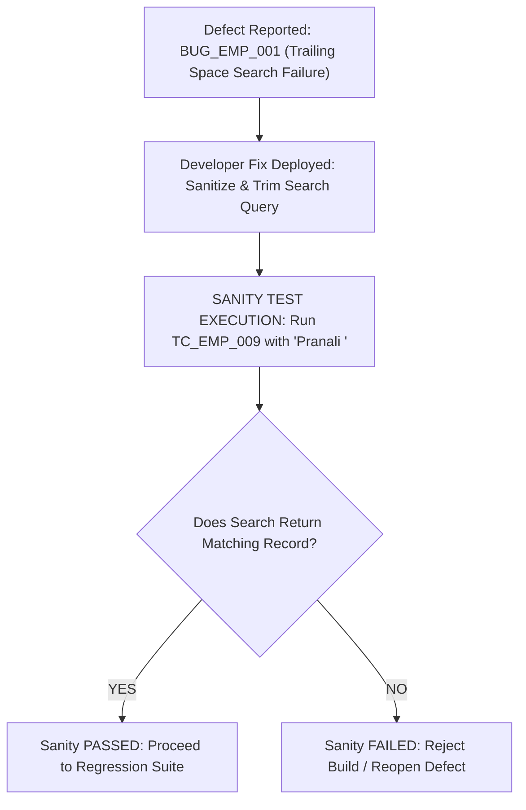

# Test Execution Strategy & Execution Summary

**Project:** OrangeHRM – Manual Testing Project  
**Author:** Pranali (QA Engineer Fresher)  
**Document Status:** Execution Framework & Test Suites  

---

## 1. Overview
This document outlines the execution organization for the OrangeHRM Manual Testing project. Rather than treating all 56 test cases uniformly, the test suite is partitioned into specialized execution cycles:
- **Smoke Testing Suite** (10 critical stability test cases)
- **Sanity Testing Strategy** (Targeted defect-fix verification)
- **Regression Testing Suite** (14 core regression test cases)
- **Retesting Workflow** (Defect resolution verification)
- **Exploratory Testing Charter** (Unscripted discovery session)

---

## 2. Smoke Testing Suite (10 Critical Cases)

### Purpose of Smoke Testing:
Smoke testing (also called "Build Verification Testing") is performed at the earliest stage of a test cycle. Its objective is to verify that the most critical, foundational paths of the application are working properly before spending hours executing in-depth positive, negative, and edge cases. If smoke testing fails, the build is blocked.

### Selected Smoke Test Cases:

| Smoke # | Test Case ID | Module | Test Case Title | Rationale for Smoke Selection |
| :---: | :--- | :--- | :--- | :--- |
| **ST-01** | `TC_LOGIN_001` | Login | Valid Login with Correct Admin Credentials | **Gatekeeper Test:** If authentication fails, no other module can be accessed. |
| **ST-02** | `TC_LOGIN_010` | Login | Successful Logout from User Profile Dropdown | Verifies session termination works cleanly. |
| **ST-03** | `TC_EMP_001` | PIM | Verify PIM Module Navigation & Page Rendering | Confirms PIM module loads and database records render. |
| **ST-04** | `TC_EMP_002` | PIM | Add New Employee with Valid Fields | Core operational workflow: verifying ability to create an employee record. |
| **ST-05** | `TC_EMP_009` | PIM | Search Employee by Valid Full Employee Name | Confirms search indexing and data retrieval operate. |
| **ST-06** | `TC_LEAVE_001`| Leave | Navigation to Leave Module & Form Display | Confirms Leave application screens and dropdown options load. |
| **ST-07** | `TC_LEAVE_002`| Leave | Submit Leave Application with Valid Dates | Core operational workflow: submitting an employee leave request. |
| **ST-08** | `TC_LEAVE_008`| Leave | Search Leave Records in Leave List by Date Range | Confirms leave records table query and date range filtering work. |
| **ST-09** | `TC_REC_001` | Recruitment | Navigation to Recruitment Module & Add Form | Confirms candidate management portal loads properly. |
| **ST-10** | `TC_REC_002` | Recruitment | Add New Candidate with Valid Details | Core operational workflow: adding an applicant to the recruitment pipeline. |

---

## 3. Sanity Testing (Targeted Verification)

### Purpose of Sanity Testing:
Sanity testing is a focused subset of testing conducted after a specific defect fix or minor build update. Unlike smoke testing (which verifies broad system stability), sanity testing evaluates the specific functionality and immediate adjoining logic of a repaired feature to determine whether the build is stable enough for wider regression.

### [SIMULATED SANITY TEST] Real-World Example:



#### Sanity Test Protocol:
1. **Defect Under Focus:** `BUG_EMP_001` (Employee search fails when trailing space is included).
2. **Developer Fix Claimed:** Search input string is wrapped with `.trim()` before backend database query.
3. **Targeted Sanity Test:**
   - Execute `TC_EMP_009` with test data `"Pranali "` (trailing space) and `"  Pranali"` (leading space).
   - Verify that search successfully retrieves "Pranali Test".
4. **Decision Rule:**
   - If Sanity passes: Defect is moved to *Retest Passed* and the 14-case Regression Suite is initiated.
   - If Sanity fails: Testing is halted immediately; defect is *Reopened* and sent back to development.

---

## 4. Retesting Workflow

### Retesting vs. Regression Testing:
- **Retesting:** Testing a specific test case that previously failed to verify whether the reported defect has been resolved.
- **Regression Testing:** Testing unmodified features to verify that the defect fix did not unintentionally break existing functionality.

### Defect Resolution Workflow:

```
[1. Execution]      TC_LEAVE_002 Failed (Past date accepted without warning)
        ↓
[2. Defect Log]     BUG_LEAVE_001 Logged (Severity: Medium | Priority: Medium)
        ↓
[3. Development]    Developer updates validation rule on Date Picker
        ↓
[4. Retesting]      Rerun TC_LEAVE_002 with past date '2023-01-01'
                    → Expected: Error message displayed
                    → Actual: Validation appears as expected
                    → Status: Defect Closed
        ↓
[5. Regression]     Execute TC_LEAVE_001, TC_LEAVE_005, TC_LEAVE_006 to ensure
                    future date submissions and single-day leave still work!
```

---

## 5. Regression Testing Suite (14 Core Cases)

### Purpose of Regression Testing:
Whenever code changes occur (such as bug fixes or updates), regression testing validates that established features have not suffered side-effects or regressions.

### Selected Regression Test Suite:

| Reg # | Test Case ID | Module | Regression Test Case Title | Potential Impact Area |
| :---: | :--- | :--- | :--- | :--- |
| **RT-01** | `TC_LOGIN_001` | Login | Valid Login with Correct Admin Credentials | Authentication core logic. |
| **RT-02** | `TC_LOGIN_002` | Login | Login with Valid Username and Invalid Password | Error banner handler. |
| **RT-03** | `TC_LOGIN_007` | Login | Login with Both Username and Password Blank | Form-level validation triggers. |
| **RT-04** | `TC_LOGIN_011` | Login | Verify Session Invalidation via Back Button | Session management cache. |
| **RT-05** | `TC_EMP_002` | PIM | Add New Employee with Valid Fields | Database insertion routines. |
| **RT-06** | `TC_EMP_004` | PIM | Add Employee with Blank First Name | Form validation routines. |
| **RT-07** | `TC_EMP_009` | PIM | Search Employee by Valid Full Employee Name | Search query engine. |
| **RT-08** | `TC_EMP_014` | PIM | Edit and Save Existing Employee Information | Update & persistence handlers. |
| **RT-09** | `TC_EMP_018` | PIM | Verify Deleted Employee Does Not Appear | Data deletion integrity. |
| **RT-10** | `TC_LEAVE_002`| Leave | Submit Leave Application with Valid Dates | Leave balance & transaction logic. |
| **RT-11** | `TC_LEAVE_005`| Leave | Validate Error when To Date Precedes From Date | Date picker boundary validation. |
| **RT-12** | `TC_LEAVE_008`| Leave | Search Leave Records in Leave List by Date Range | Leave grid data filtering. |
| **RT-13** | `TC_REC_002` | Recruitment | Add New Candidate with Valid Details | Candidate record creation. |
| **RT-14** | `TC_REC_012` | Recruitment | Shortlist Candidate via Recruitment Workflow | Workflow status transition engine. |

---

## 6. Exploratory Testing Session

### Exploratory Testing Charter:
- **Session ID:** `ETS-ORANGEHRM-01`
- **Tester:** Pranali (QA Engineer Fresher)
- **Charter:** Explore input boundary limits, rapid interaction responsiveness, and data format resilience across PIM and Recruitment modules.
- **Time Box:** 45 minutes
- **Environment:** Windows 11 / Chrome v128 / OrangeHRM 5.x Public Demo

### Session Log & Findings:

| Area Explored | Action & Exploration | Observation | Finding / Defect Reference |
| :--- | :--- | :--- | :--- |
| **PIM Search Field** | Typed employee name followed by space character (`"Pranali "`) and clicked search. | Search requires exact match without space; fails to auto-trim. | Logged as `BUG_EMP_001`. |
| **Recruitment Resume** | Uploaded file with two extensions (`sample_resume.pdf.doc`). | Upload dialog accepted file without inspecting actual file headers. | Logged as `BUG_REC_001`. |
| **Leave Date Picker** | Typed past year date (`2023-01-01`) manually into date input box. | Form allowed entry without immediate red boundary indicator. | Logged as `BUG_LEAVE_001`. |
| **Rapid Double Click**| Double clicked "Save" on Add Employee form rapidly. | Save button was disabled after first click, preventing duplicate records. | **Positive Observation:** System handles duplicate submit gracefully. |

---

## 7. Test Metrics Baseline

> [!NOTE]  
> In accordance with ethical QA standards, test execution metrics are recorded based strictly on genuine manual testing. Below is the official execution baseline:

- **Total Test Cases Planned:** 56
- **Test Cases Executed:** Pending candidate manual execution run
- **Passed:** Pending execution
- **Failed:** Pending execution
- **Blocked:** 0
- **Total Defects Identified / Simulated:** 6
- **Pass Percentage:** Pending manual execution run
