# Defect Management & Defect Summary

**Project:** OrangeHRM – Manual Testing Project  
**Author:** Pranali (QA Engineer Fresher)  
**Testing Methodology:** Manual Defect Reporting & Tracking  

---

## 1. Overview
Defect management is a critical stage in the Software Testing Life Cycle (STLC). Identifying, isolating, documenting, and tracking defects to closure ensures that software discrepancies are clearly communicated to development teams for timely resolution.

This document details:
1. Standard Defect Report Template & Attributes
2. Defect Authenticity Classification (Confirmed, Exploratory, Simulated)
3. Defect Lifecycle Process
4. Severity vs. Priority Classification with Real Project Examples
5. Complete Log of 6 Discovered & Simulated Defects

---

## 2. Standard Defect Report Template

Every defect logged in this project contains the following standardized attributes:

| Field Name | Description |
| :--- | :--- |
| **Defect ID** | Unique alphanumeric identifier (e.g., `BUG_EMP_001`). |
| **Classification** | Nature of the defect (`Confirmed Defect`, `Potential Defect / Exploratory Finding`, or `Simulated Defect`). |
| **Defect Title** | Concise, descriptive summary stating the exact problem and location. |
| **Module** | Specific application module (Login, PIM, Leave, Recruitment). |
| **Environment** | OS, browser version, and application build under test. |
| **Preconditions** | System state required prior to executing reproduction steps. |
| **Test Data** | Exact input strings, dates, or file payloads used during reproduction. |
| **Steps to Reproduce** | Numbered, step-by-step instructions enabling any tester or developer to replicate the bug. |
| **Expected Result** | Correct behavior according to functional specifications. |
| **Actual Result** | Observed erroneous behavior or system output. |
| **Severity** | Technical impact on the application's functionality (Critical, High, Medium, Low). |
| **Priority** | Urgency of fixing the defect from a business/release perspective (High, Medium, Low). |
| **Reproducibility** | Frequency of occurrence (Always 100%, Intermittent, Once). |
| **Status** | Current state in the defect lifecycle (New, Open, Fixed, Retest, Closed, Reopened). |
| **Test Case ID** | ID of the specific test case during whose execution the defect was found. |
| **Evidence Reference** | Name of the screenshot or file reference demonstrating the issue. |
| **Comments** | Additional diagnostic information or technical observations. |

---

## 3. Defect Authenticity Classification

To maintain 100% honesty and credibility for a fresher portfolio, all 6 defects are classified into three transparent categories:

1. **Confirmed Defect (2 Defects):**  
   Issues that were directly reproduced on the public OrangeHRM 5.x demo instance (`BUG_EMP_001` and `BUG_LEAVE_001`).
2. **Potential Defect / Exploratory Finding (3 Defects):**  
   Subtle edge-case observations, input sanitation gaps, or UI reactivity delays discovered during exploratory charters (`BUG_REC_001`, `BUG_EMP_002`, and `BUG_REC_002`).
3. **Simulated Defect for Lifecycle Demonstration (1 Defect):**  
   A controlled scenario (`BUG_LOGIN_001`) used specifically to demonstrate how a tester conducts Retesting, verifies a developer fix, and transitions a defect from `New -> Open -> Fixed -> Retest -> Closed`.

---

## 4. Defect Severity vs. Defect Priority

Understanding the difference between **Severity** and **Priority** is a vital competency for a QA tester:

- **Defect Severity:** Measures the **technical impact** of the defect on the system's operational capability. (Determined by the **Tester** based on how badly functionality is broken).
- **Defect Priority:** Measures the **business urgency** of fixing the defect based on company objectives, timelines, and user exposure. (Determined by **Product Owners / Test Leads**).

### Real Project Comparative Matrix:

| Combination | Definition | Example from OrangeHRM Project |
| :--- | :--- | :--- |
| **High Severity & High Priority** | Critical functionality is broken with no workaround; urgent release blocker. | **Example:** Login button completely unresponsive; no user can authenticate to access the application. |
| **High Severity & Low Priority** | Major system error that destroys data, but occurs in an obscure, rarely used edge feature. | **Example:** Archiving an employee record created 15 years ago crashes the database server, but archiving older records is scheduled once a year. |
| **Low Severity & High Priority** | Minor functional impact, but visible to all users or damaging to company branding/reputation. | **Example:** Company logo on the login page renders inverted, or the company title displays as `"OrangeHRM - Compnay Portel"` (spelling mistake on main public landing page). |
| **Low Severity & Low Priority** | Cosmetic or subtle discrepancy with minimal impact and simple workarounds. | **Example:** Trailing zeros stripped in list view for Employee ID (`BUG_EMP_002`) or minor tooltip alignment offset. |

---

## 5. Defect Lifecycle

The following state machine governs how defects transition from discovery to closure:

```mermaid
stateDiagram-v2
    [*] --> New: Tester discovers & logs bug
    New --> Assigned: Lead reviews & assigns to Developer
    Assigned --> Open: Developer analyzes & replicates bug
    Open --> Fixed: Developer implements fix & deploys build
    Fixed --> Retest: Tester re-executes original Test Case
    Retest --> Closed: Fix verified; defect resolved
    Retest --> Reopened: Defect still reproduces in build
    Reopened --> Open: Returned to Developer for fix
    Closed --> [*]
```

### Explanation of States:
1. **New:** Defect is identified and logged by the tester.
2. **Assigned:** Test lead/manager reviews the bug and assigns it to the relevant developer.
3. **Open:** Developer analyzes the bug, confirms reproduction, and starts coding a solution.
4. **Fixed:** Developer fixes the code, runs local unit tests, and deploys a test build.
5. **Retest:** QA tester re-runs the original test case (e.g., `TC_EMP_009`) in the test environment.
6. **Closed:** If the fix works as expected, the tester formally marks the defect as Closed.
7. **Reopened:** If the defect still reproduces during retesting, the tester updates comments and reopens the bug.

---

## 6. Comprehensive Defect Log (6 Defects)

---

### Defect 1: BUG_EMP_001
- **Classification:** `Confirmed Defect`
- **Title:** Employee search by Employee Name fails when trailing whitespace is present in search input
- **Module:** Employee Management (PIM)
- **Environment:** Windows 11 / Google Chrome v128 / OrangeHRM 5.x Public Demo
- **Severity:** Medium | **Priority:** Medium | **Status:** Open
- **Associated Test Case:** `TC_EMP_009`
- **Preconditions:** Active employee "Pranali Test" exists in PIM Employee List.
- **Test Data:** `Employee Name: "Pranali " (with trailing whitespace)`
- **Steps to Reproduce:**
  1. Navigate to `PIM` > `Employee List`.
  2. In the `Employee Name` search input field, type `"Pranali "` (including a space character at the end).
  3. Click the `Search` button.
- **Expected Result:** System should sanitize input by trimming leading/trailing whitespace automatically and retrieve the matching record for "Pranali Test".
- **Actual Result:** System attempts an exact literal query with the space, fails to resolve the autocomplete entry, and displays `"No Records Found"`.
- **Evidence Reference:** `BUG_EMP_001_trailing_space_search.png`
- **Comments:** Highly relevant for real users who copy-paste names containing accidental whitespace.

---

### Defect 2: BUG_LEAVE_001
- **Classification:** `Confirmed Defect`
- **Title:** Leave Date picker allows manual entry of past dates without immediate validation warning
- **Module:** Leave Management
- **Environment:** Windows 11 / Google Chrome v128 / OrangeHRM 5.x Public Demo
- **Severity:** Medium | **Priority:** Medium | **Status:** Open
- **Associated Test Case:** `TC_LEAVE_002`
- **Preconditions:** User is logged in and on Leave > Apply page with allocated balance.
- **Test Data:** `Leave Type: "US - Vacation", From Date: "2023-01-01", To Date: "2023-01-02"`
- **Steps to Reproduce:**
  1. Select a valid Leave Type (e.g., "US - Vacation").
  2. In the `From Date` field, manually type past date `"2023-01-01"`.
  3. In the `To Date` field, manually type past date `"2023-01-02"`.
  4. Click `Apply` button.
- **Expected Result:** System should validate date chronology against current system date and display an inline warning: `"Leave cannot be applied for past dates"`.
- **Actual Result:** UI accepts input without client-side warning; upon submission, request either fails with an uninformative backend error or logs invalid past records.
- **Evidence Reference:** `BUG_LEAVE_001_past_date_warning.png`
- **Comments:** Client-side boundary validation missing on manual text entry for date inputs.

---

### Defect 3: BUG_REC_001
- **Classification:** `Potential Defect / Exploratory Finding`
- **Title:** Resume file upload allows double extension files (e.g., `resume.pdf.doc`) without explicit MIME-type verification
- **Module:** Recruitment
- **Environment:** Windows 11 / Google Chrome v128 / OrangeHRM 5.x Public Demo
- **Severity:** Low | **Priority:** Low | **Status:** Open
- **Associated Test Case:** `TC_REC_008`
- **Preconditions:** User is on Recruitment > Add Candidate page.
- **Test Data:** `File Name: "sample_resume.pdf.doc" (Size: 250 KB)`
- **Steps to Reproduce:**
  1. Enter valid First Name, Last Name, and Email.
  2. In the Resume upload file picker, select a file named `"sample_resume.pdf.doc"`.
  3. Click `Save` button.
- **Expected Result:** System should validate that file extensions are singular and verify file MIME type prior to acceptance.
- **Actual Result:** System accepts the file because it only inspects the terminal extension (`.doc`), bypassing multi-extension safety checks.
- **Evidence Reference:** `BUG_REC_001_double_extension.png`
- **Comments:** Minor security sanitation oversight identified during exploratory testing.

---

### Defect 4: BUG_LOGIN_001
- **Classification:** `Simulated Defect (Lifecycle Demo)`
- **Title:** Password input allows pasting plain text containing leading spaces without input sanitation warning
- **Module:** Login
- **Environment:** Windows 11 / Microsoft Edge v128 / OrangeHRM 5.x Public Demo
- **Severity:** Low | **Priority:** Low | **Status:** Closed (Simulated Fix & Retest)
- **Associated Test Case:** `TC_LOGIN_002`
- **Preconditions:** User is on the login page.
- **Test Data:** `Username: "Admin", Password: " admin123" (with leading space)`
- **Steps to Reproduce:**
  1. Copy `" admin123"` (with a leading space) to clipboard.
  2. Paste into the Password field.
  3. Enter `"Admin"` in Username and click `Login`.
- **Expected Result:** Authentication should fail with standard message, but helper text or trim behavior should handle whitespace gracefully.
- **Actual Result:** Authentication rejected as expected; retested in cycle 2 to confirm security password hashing preserves strict characters without plaintext leakage.
- **Evidence Reference:** `BUG_LOGIN_001_password_space.png`
- **Comments:** Used for demonstrating retesting lifecycle and defect closure.

---

### Defect 5: BUG_EMP_002
- **Classification:** `Potential Defect / Exploratory Finding`
- **Title:** Employee ID leading zeros stripped in table view causing visual discrepancy with search input
- **Module:** Employee Management (PIM)
- **Environment:** Windows 11 / Google Chrome v128 / OrangeHRM 5.x Public Demo
- **Severity:** Low | **Priority:** Low | **Status:** Open
- **Associated Test Case:** `TC_EMP_007`
- **Preconditions:** Add employee with ID `"0089"`.
- **Test Data:** `Employee ID: "0089", Names: "Test", "LeadingZero"`
- **Steps to Reproduce:**
  1. Navigate to `PIM` > `Add Employee`.
  2. Enter names and specify custom Employee ID as `"0089"`.
  3. Click `Save`.
  4. Search for `"0089"` in Employee List.
- **Expected Result:** Employee List table should display ID formatted as `"0089"`, preserving user-entered leading zeros.
- **Actual Result:** System strips leading zeros and renders ID as `"89"`, causing visual confusion when searching with `"0089"`.
- **Evidence Reference:** `BUG_EMP_002_leading_zeros.png`
- **Comments:** String vs integer datatype parsing mismatch on UI display layer.

---

### Defect 6: BUG_REC_002
- **Classification:** `Potential Defect / Exploratory Finding`
- **Title:** Candidate search by Vacancy does not reset results count text until full page reload
- **Module:** Recruitment
- **Environment:** Windows 11 / Google Chrome v128 / OrangeHRM 5.x Public Demo
- **Severity:** Low | **Priority:** Low | **Status:** Open
- **Associated Test Case:** `TC_REC_011`
- **Preconditions:** User has applied a search filter in Recruitment > Candidates.
- **Test Data:** `Job Vacancy dropdown: "QA Lead", Filter Action: Click Search then Reset`
- **Steps to Reproduce:**
  1. Search candidates by vacancy that yields 2 records.
  2. Click the `Reset` button on the search card.
  3. Observe the `(2) Records Found` text counter above the table.
- **Expected Result:** Counter text should dynamically update to reflect total unfiltered candidate count upon clicking Reset.
- **Actual Result:** Grid refreshes to display all candidates, but the `(2) Records Found` label intermittently retains old count until page reload.
- **Evidence Reference:** `BUG_REC_002_counter_lag.png`
- **Comments:** Minor UI reactivity lag in Vue.js frontend state.
