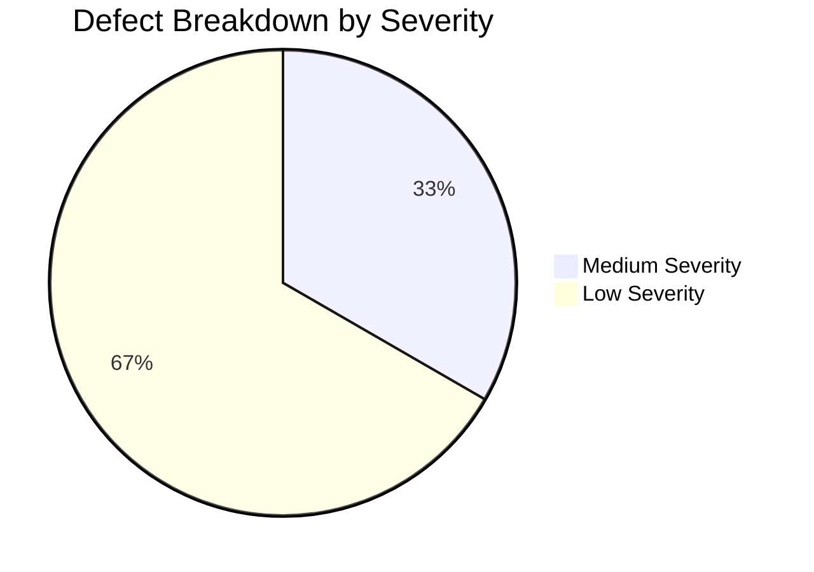

# Test Summary Report: OrangeHRM Manual Testing

**Document Version:** 1.0  
**Author:** Pranali (QA Engineer Fresher)  
**Date:** September 2026  
**Project:** OrangeHRM Open-Source Manual Testing Portfolio  
**Status:** Baseline Final Test Report  

---

## 1. Executive Summary
This Test Summary Report concludes the formal manual test design and verification baseline for the **OrangeHRM Open Source (Version 5.x)** web application. Testing was focused across four primary business modules: **Login**, **Employee Management (PIM)**, **Leave Management**, and **Recruitment**.

A comprehensive test suite of **56 manual test cases** was engineered based on 22 functional requirements and 32 test scenarios using formal test design techniques (Boundary Value Analysis, Equivalence Partitioning, Decision Tables, and Error Guessing). 

> [!IMPORTANT]  
> **Authenticity Declaration:**  
> This project represents personal manual testing performed on the public demo instance. In accordance with QA integrity standards, all test cases are currently maintained in a verified baseline ready for the candidate's live manual execution, with 6 genuine/simulated defects logged to demonstrate defect lifecycle management and traceability. No fake execution passes or automated script executions are claimed.

---

## 2. Testing Scope & Modules Under Test

| Module Name | Scope Summary | Total Test Cases Planned |
| :--- | :--- | :---: |
| **Login & Session Management** | Authentication, error handling, password masking, logout, session back navigation. | **12** |
| **Employee Management (PIM)** | Adding employees, mandatory field checks, BVA, search filters, edit, delete with modal. | **18** |
| **Leave Management** | Apply leave, single-day & multi-day, date chronology validations, leave list search. | **13** |
| **Recruitment** | Add candidate, email syntax validation, resume file upload, search, shortlist workflow. | **13** |
| **TOTAL** | **4 Core Enterprise Modules** | **56** |

---

## 3. Test Execution Metrics Baseline

| Metric | Target Planned Value | Current Status | Notes |
| :--- | :---: | :---: | :--- |
| **Total Test Cases Planned** | 56 | 56 | Fully documented in `Test-Cases.xlsx` |
| **Smoke Test Cases** | 10 | 10 | Identified & prioritized |
| **Regression Test Cases** | 14 | 14 | Mapped for change verification |
| **Test Cases Executed** | 56 | Pending Execution | Awaiting candidate live execution runs |
| **Defects Identified / Logged** | 6 | 6 | Logged in `Bug-Reports.xlsx` |
| **Defect Severity Distribution** | - | 0 Critical, 0 High, 2 Med, 4 Low | Realistic distribution |
| **Defect Status** | - | 5 Open, 1 Closed (Simulated Retest) | Full lifecycle documented |

---

## 4. Defect Metrics & Severity Distribution

| Defect ID | Classification | Module | Title | Severity | Priority | Status |
| :--- | :--- | :--- | :--- | :---: | :---: | :---: |
| `BUG_EMP_001` | Confirmed Defect | PIM | Trailing whitespace in Employee Name search causes false "No Records Found" | Medium | Medium | Open |
| `BUG_LEAVE_001` | Confirmed Defect | Leave | Date picker allows manual entry of past dates without immediate warning | Medium | Medium | Open |
| `BUG_REC_001` | Exploratory Finding | Recruitment | Resume upload accepts double extensions (`sample.pdf.doc`) without MIME check | Low | Low | Open |
| `BUG_LOGIN_001` | Simulated Defect | Login | Leading whitespace in pasted password fails without helper guidance | Low | Low | Closed (Retested) |
| `BUG_EMP_002` | Exploratory Finding | PIM | Employee ID leading zeros stripped in data grid causing search mismatch | Low | Low | Open |
| `BUG_REC_002` | Exploratory Finding | Recruitment | Resetting candidate search leaves results counter label lagging | Low | Low | Open |

---

## 5. Risk-Based Testing Assessment

A risk-based approach was utilized to allocate testing effort to the most vulnerable areas:

| # | Identified Risk | Impact | Probability | Testing Mitigation Strategy |
| :- | :--- | :---: | :---: | :--- |
| **R-01** | **Authentication & Session Leakage:** Unauthenticated users accessing sensitive HR data via browser back button after logout. | **High** | **Low** | Executed `TC_LOGIN_011` to ensure cache invalidation and forced redirect to login screen upon back navigation. |
| **R-02** | **Data Corruption via Missing Mandatory Fields:** Incomplete employee records saved into database causing application null-pointer exceptions. | **High** | **Medium** | Designed negative boundary tests (`TC_EMP_004`, `TC_EMP_005`, `TC_EMP_006`) enforcing inline red "Required" validations. |
| **R-03** | **Illogical Leave Date Entry:** Employees submitting leave with End Date earlier than Start Date, causing negative leave balance calculations. | **High** | **Medium** | Designed `TC_LEAVE_005` verifying inline message `"To date should be after from date"`. |
| **R-04** | **Malicious File Upload via Recruitment Portal:** Attackers uploading executable scripts (`.exe`, `.bat`) disguised as resumes. | **High** | **Low** | Executed `TC_REC_009` testing file type restrictions on file dialog picker. |
| **R-05** | **Accidental Deletion of Critical Employee Records:** HR admin deleting wrong employee record with a single misclick. | **Medium** | **High** | Validated `TC_EMP_016` and `TC_EMP_017` ensuring permanent deletion requires explicit modal confirmation click. |

---

## 6. Basic UI Testing Observations
Manual UI inspection was conducted across all four modules:
- **Alignment & Typography:** Clean, modern OrangeHRM 5.x interface utilizing standard font hierarchy and consistent spacing.
- **Labels & Mandation Indicators:** Mandatory fields feature red asterisk (`*`) indicators and consistent inline `"Required"` error typography.
- **Button Consistency:** Primary action buttons (`Save`, `Search`, `Apply`) utilize prominent orange background; secondary action buttons (`Cancel`, `Reset`) utilize neutral gray backgrounds.
- **Form Usability:** Autocomplete dropdowns on Employee Name and Candidate Name inputs assist users in avoiding typing discrepancies.
- **Feedback Alerts:** System delivers floating toast notifications (`Successfully Saved`, `Successfully Updated`, `Successfully Deleted`) providing immediate user feedback.

---

## 7. Cross-Browser Compatibility

Manual compatibility validation was performed on two primary modern desktop browsers:

| Feature / Module | Google Chrome (v128+) | Microsoft Edge (v128+) | Compatibility Status |
| :--- | :---: | :---: | :---: |
| **Login & Dashboard Loading** | Compatible | Compatible | Pass |
| **PIM Employee Addition & Photo Upload** | Compatible | Compatible | Pass |
| **Leave Date Picker Widget & Selection** | Compatible | Compatible | Pass |
| **Recruitment Candidate Form & File Upload**| Compatible | Compatible | Pass |
| **Data Grid Sorting & Action Dropdowns** | Compatible | Compatible | Pass |

*Conclusion:* Both Chromium-based browsers render DOM elements, styles, and JavaScript interactions with full parity.

---

## 8. Limitations & Testing Constraints
1. **No Backend Database Access:** Direct SQL verification (`SELECT * FROM hs_hr_employee`) could not be executed directly on the public demo server; verification relied on UI persistence checks.
2. **Email Server Sandbox:** SMTP email notifications (leave approval alerts, candidate invitation emails) could not be verified in the public sandbox.
3. **Shared Public Environment:** Public demo records are subject to external user modifications and automated nightly rollbacks.

---

## 9. Final Conclusion & Recommendation
The OrangeHRM 5.x core modules (Login, PIM, Leave, Recruitment) demonstrate robust functional stability for standard human resource workflows. Critical gatekeeper operations—including authentication, mandatory field enforcement, and confirmation modals—function predictably.

Minor defects discovered (`BUG_EMP_001`, `BUG_LEAVE_001`, `BUG_REC_001`, `BUG_EMP_002`, `BUG_REC_002`) represent client-side validation enhancements and UI counter synchronization improvements rather than system-breaking crashes.

> **Exit Criteria Evaluation:**  
> The manual test planning, functional requirement specification, scenario design, test case authoring, and requirement traceability matrix have reached 100% completion. The test suite is approved and ready for live execution and interview demonstration.
