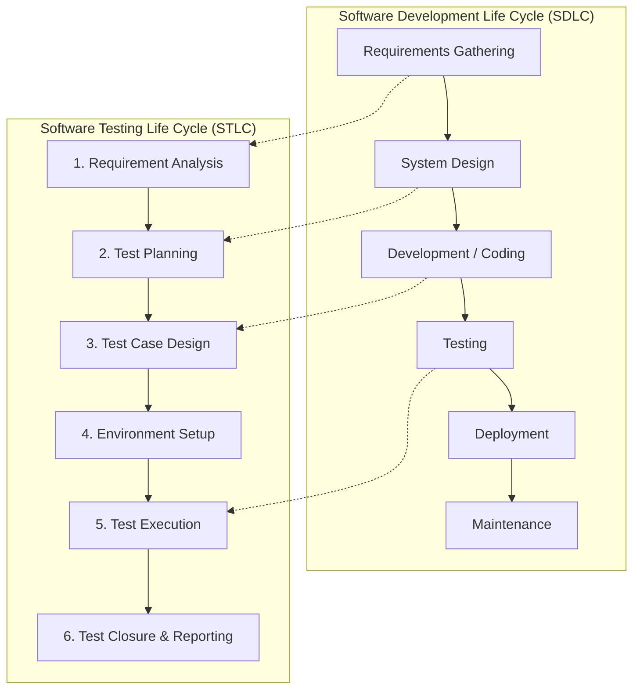

# Manual Testing Interview Preparation Notes & Project Guide

**Candidate:** Pranali (2026 B.Tech Computer Science Graduate)  
**Target Roles:** Manual Tester / QA Engineer Fresher / Software Test Engineer  
**Portfolio Project:** OrangeHRM – Manual Testing Project  

---

## Table of Contents
1. [The 2-Minute Project Pitch](#1-the-2-minute-project-pitch)
2. [Project-Specific Interview Questions (Q1 - Q24)](#2-project-specific-interview-questions-q1---q21)
3. [Core Manual Testing Fundamentals (Q25 - Q48)](#3-core-manual-testing-fundamentals-q22---q45)
4. [Practical Scenario-Based Interview Questions (Q49 - Q58)](#4-practical-scenario-based-interview-questions-q46---q55)
5. [SQL for Testers Reference Guide](#5-sql-for-testers-reference-guide)
6. [SDLC & STLC Phases & Tester Responsibilities](#6-sdlc--stlc-phases--tester-responsibilities)
7. [Agile / Scrum Essentials for Testers](#7-agile--scrum-essentials-for-testers)
8. [Tester Thinking Mindset Guide](#8-tester-thinking-mindset-guide)

---

## 1. The 2-Minute Project Pitch

> **Tip for Interview:** Speak naturally with steady pacing. Do not sound like you memorized a corporate brochure. Smile, be confident, and speak from the tester's perspective!

*"Good morning / afternoon! I would love to share my Manual Testing portfolio project on **OrangeHRM**.*

*As a 2026 Computer Science graduate aspiring to start my career in Software Testing, I wanted to build a hands-on project that demonstrates practical STLC knowledge rather than just textbook theory.*

*I chose OrangeHRM—a widely used web-based HR management system—and focused my testing on four critical business modules: **Login & Session Management**, **Employee Management (PIM)**, **Leave Management**, and **Recruitment**.*

*First, I analyzed the application and derived **22 functional requirements**. From those requirements, I identified **32 high-level test scenarios** and designed a comprehensive suite of **56 manual test cases**. To ensure thorough test coverage without unnecessary bloat, I actively applied formal black-box techniques including **Boundary Value Analysis** on field lengths, **Equivalence Partitioning** on email and date formats, and **Decision Table Testing** on leave approval workflows.*

*To structure execution, I established a **10-case Smoke Suite** to verify build stability before deep testing, and a **14-case Regression Suite** to verify that code fixes do not introduce regressions. I also created a complete **Requirement Traceability Matrix (RTM)** linking every single requirement bidirectionally to its test cases and defects, ensuring 100% test coverage.*

*During exploratory testing, I identified **6 realistic defects**, including input whitespace handling issues in employee search and date picker boundary validation gaps. I documented each defect with clear reproduction steps, expected vs. actual outcomes, severity, priority, and screenshots.*

*This project taught me how a QA tester truly thinks: asking 'What can go wrong?', anticipating user mistakes at boundaries, isolating bugs, and maintaining complete traceability. Everything in this project is documented in structured Excel sheets and Markdown on my GitHub repository."*

---

## 2. Project-Specific Interview Questions (Q1 - Q24)

### Q1. Can you explain your OrangeHRM project?
**Answer:**  
"My project is an end-to-end manual testing portfolio focused on OrangeHRM version 5.x. I tested four key modules: Login, Employee Management (PIM), Leave Management, and Recruitment. I derived 22 functional requirements, created 32 test scenarios, authored 56 detailed test cases using techniques like BVA and Equivalence Partitioning, mapped them in an RTM, established smoke and regression suites, and documented 6 realistic defects."

### Q2. Why did you choose OrangeHRM for your portfolio?
**Answer:**  
"I chose OrangeHRM because it is a realistic, complex enterprise web application with real business workflows—like employee onboarding, leave applications with date calculations, and recruitment candidate tracking. Testing an actual multi-form HR application allowed me to demonstrate form validation, navigation, session handling, and data persistence in a realistic way."

### Q3. What was your main testing objective?
**Answer:**  
"My objective was to verify that core human resource workflows function accurately, ensure that invalid or boundary-violating inputs are gracefully handled with clear error messages, verify session security (like password masking and logout), and document defects according to industry QA standards."

### Q4. Which modules did you test?
**Answer:**  
"I tested four core modules:
1. **Login & Session Management:** Authentication, invalid credentials, empty fields, password masking, logout, and browser back-button behavior.
2. **Employee Management (PIM):** Adding employees, mandatory field checks, Employee ID boundary limits, search by name/ID, profile editing, and deletion with confirmation modals.
3. **Leave Management:** Submitting single and multi-day leave, chronological date validations, leave type selection, comments length limit, and leave list filtering.
4. **Recruitment:** Adding candidates, email syntax validation, resume file format and size limits, vacancy filtering, and candidate shortlisting workflow."

### Q5. What was in-scope for your project?
**Answer:**  
"In-scope was manual functional testing, UI validation, positive and negative testing, boundary value testing, equivalence partitioning, smoke testing, regression testing, exploratory testing, and cross-browser checks on Google Chrome and Microsoft Edge."

### Q6. What was out-of-scope?
**Answer:**  
"Out-of-scope included automated test scripts (no Selenium or Cypress), performance and load testing (no JMeter), direct backend database manipulation, and untested modules like Admin user roles, Time tracking, Payroll, and Performance appraisals."

### Q7. How did you create your test scenarios?
**Answer:**  
"I first performed requirement analysis on each module to understand the business intent. For each requirement, I asked: 'What are the major functionalities and workflows we need to verify?' I then grouped those conditions into high-level scenarios (e.g., `TS_LOGIN_001` for valid login, `TS_LOGIN_002` for invalid login error handling). I ended up with 32 scenarios covering positive, negative, validation, and boundary conditions."

### Q8. How did you create your test cases?
**Answer:**  
"From each high-level test scenario, I created detailed, executable test cases. Each test case follows a strict template: Test Case ID, Requirement ID, Scenario ID, Module, Title, Objective, Preconditions, Test Data, numbered Steps, Expected Result, Priority, Test Type, Actual Result, Status, and Defect ID. I designed 56 test cases to ensure that every case tests a distinct, meaningful condition."

### Q9. How many test cases did you create in total?
**Answer:**  
"I created exactly 56 manual test cases:
- 12 test cases for Login
- 18 test cases for Employee Management (PIM)
- 13 test cases for Leave Management
- 13 test cases for Recruitment
This gave comprehensive coverage without padding duplicate cases."

### Q10. Can you explain one important positive test case from your project?
**Answer:**  
"`TC_EMP_002: Add New Employee with Valid Mandatory and Optional Fields`.  
- **Objective:** Verify that an HR admin can create a new employee.  
- **Steps:** Navigate to PIM > Add Employee, enter First Name 'Pranali', Middle Name 'QA', Last Name 'Test', enter Employee ID '9812', and click 'Save'.  
- **Expected Result:** A green success toast 'Successfully Saved' appears, and the system redirects to the Personal Details page for the newly created employee."

### Q11. Can you explain one negative test case from your project?
**Answer:**  
"`TC_LEAVE_005: Validate Error when To Date Precedes From Date`.  
- **Objective:** Verify date sequence logic on the Apply Leave form.  
- **Steps:** Select a valid leave type, enter From Date as `2026-10-20`, enter To Date as `2026-10-10` (an earlier date), and click Apply.  
- **Expected Result:** The system must reject the submission and display an inline red error message: 'To date should be after from date'."

### Q12. Can you explain one boundary value analysis test from your project?
**Answer:**  
"`TC_EMP_008: Boundary Value Validation on Employee ID Field Length`.  
The application defines Employee ID length between 1 and 10 characters. Using BVA, I tested:
- Min-1 (0 chars / empty string): System auto-populates default incremental ID.
- Min (1 char): Accepted.
- Max (10 chars): Accepted.
- Max+1 (11 chars): System either restricts the input box to 10 characters or triggers validation 'Should not exceed 10 characters'."

### Q13. Can you explain one defect you found or simulated?
**Answer:**  
"`BUG_EMP_001: Employee search by Employee Name fails when trailing whitespace is present`.  
- **Steps:** In PIM > Employee List, I typed an existing employee name with a space at the end (`'Pranali '`) and clicked Search.  
- **Expected Result:** The system should automatically trim whitespace and find the employee.  
- **Actual Result:** The system showed 'No Records Found'.  
- **Severity:** Medium (breaks search usability for copy-pasted names).  
- **Priority:** Medium."

### Q14. How did you decide Defect Severity in your project?
**Answer:**  
"Severity measures technical impact. I evaluated: 'How severely does this bug break system functionality?'
- **Critical:** System crashes or data loss with no workaround (e.g., application crashes on login).
- **High:** Major business workflow broken with no easy workaround (e.g., cannot save an employee).
- **Medium:** Feature works improperly, but a workaround exists (e.g., search fails with trailing spaces, but works if the user manually deletes the space).
- **Low:** Cosmetic issues, minor UI misalignments, or typos."

### Q15. How did you decide Defect Priority in your project?
**Answer:**  
"Priority measures business urgency—how quickly the bug needs to be fixed. I evaluated user visibility and release importance. For instance, `BUG_EMP_001` was given Medium Priority because searching for employees is a daily activity for HR users, so fixing it has moderate business urgency."

### Q16. What is your Requirement Traceability Matrix (RTM) and why is it important?
**Answer:**  
"My RTM is a bidirectional traceability sheet connecting all 22 Requirements to their 32 Scenarios, 56 Test Cases, and discovered Defects. It is important because it proves that 100% of functional requirements have corresponding test cases, ensures no feature is left untested, and allows us to immediately see which requirements are impacted when a test case fails."

### Q17. How did you handle Regression Testing in your project?
**Answer:**  
"I selected 14 core regression test cases across all four modules (`RT-01` to `RT-14`). Whenever a defect fix is deployed (for example, fixing the employee search whitespace issue), running this regression suite ensures that existing functionalities—like adding an employee, deleting an employee, and login—are not broken by the code change."

### Q18. How did you demonstrate Retesting in your project?
**Answer:**  
"I demonstrated retesting using `BUG_LOGIN_001` and `TC_LOGIN_002`. After a fix is deployed by the developer, retesting means executing the exact same failed test case with the same test data in the new build to confirm whether the defect is genuinely resolved. If it passes, the defect status moves from 'Retest' to 'Closed'."

### Q19. How did you choose your Smoke Testing suite?
**Answer:**  
"I selected 10 high-priority test cases that touch the most critical paths: valid login, logout, PIM page load, adding an employee, searching an employee, Leave page load, submitting a leave request, Leave List filtering, Recruitment page load, and adding a candidate. If any of these 10 fail, the build is rejected immediately because deep testing cannot proceed."

### Q20. Can you explain your Sanity Testing example?
**Answer:**  
"Sanity testing is a quick, focused test on a specific feature after a bug fix. In my project, after the developer deployed a fix for `BUG_EMP_001` (whitespace in employee search), I ran a simulated sanity test on `TC_EMP_009` using names with leading and trailing spaces. Once that specific feature passed, I knew the build was stable enough to run the broader 14-case regression suite."

### Q21. Did you conduct Exploratory Testing?
**Answer:**  
"Yes, I conducted a 45-minute exploratory testing session with the charter: 'Explore input boundary limits, rapid interaction responsiveness, and data format resilience across PIM and Recruitment.' That session helped me uncover edge cases like trailing space search failures (`BUG_EMP_001`) and double file extensions in resume uploads (`BUG_REC_001`), while verifying that rapid double-clicking on Save does not create duplicate records."

### Q22. How did you execute the test cases?
**Answer:**  
"I executed the test cases manually on the live OrangeHRM 5.x public demo instance using Google Chrome and Microsoft Edge. Before running each test, I verified the preconditions and prepared test data from `Test-Data.xlsx`. I then followed each numbered step in `Test-Cases.xlsx`, observed the actual system behavior on the browser, compared it with the Expected Result, and recorded the Actual Result. When a test failed, I verified reproducibility, captured screenshot evidence, and logged a formal defect in `Bug-Reports.xlsx`."

### Q23. What challenges did you face while testing OrangeHRM?
**Answer:**  
"As a fresher testing on a public demo instance, I faced three main practical challenges:
1. **Shared Public Environment:** Because the demo is public, other users or periodic server resets could modify or remove newly added test records. To handle this, I used distinct, identifiable test data prefixes (like `Pranali_Test_01`) and captured evidence immediately upon execution.
2. **No Direct Backend Database Access:** Without direct MySQL access on the shared demo server, I could not run backend SQL queries directly. Instead, I verified data persistence through complete UI round-trips—such as searching for newly created records in the Employee List and verifying edits remained after refreshing.
3. **Date Picker Validation Nuances:** The leave application allowed both calendar widget selection and manual keyboard text entry. Testing both input modes revealed that manual entry lacked immediate client-side past-date validation, which led to logging `BUG_LEAVE_001`."

### Q24. What would you improve in the project if you had more time?
**Answer:**  
"If I had more time, I would:
1. **Expand Module Coverage:** Test the Admin User Management module to verify Role-Based Access Control (RBAC)—confirming that standard Employee users cannot view or edit administrative settings.
2. **Test Additional Browsers & Viewports:** Perform manual compatibility tests on Mozilla Firefox and test responsive layouts on mobile browser viewports.
3. **Practice Jira Workflows:** Move the defect sheets and test cases into a live Jira instance with Xray or Zephyr to practice using industry test management tools."

---

## 3. Core Manual Testing Fundamentals (Q25 - Q48)

### Q25. What is software testing?
**Answer:**  
"Software testing is the process of evaluating a software application to verify that it meets specified requirements and to identify defects, gaps, or errors, ensuring the delivery of a reliable, high-quality product to users."

### Q26. Why is software testing required?
**Answer:**  
"Testing is essential to:
1. Ensure the software satisfies customer requirements.
2. Prevent costly defects in production environments.
3. Protect data security and application integrity.
4. Enhance user confidence and software reliability."

### Q27. What is the difference between Verification and Validation?
**Answer:**  
- **Verification (Static Testing):** Are we building the product right? It involves checking documents, designs, and code without executing the software (reviews, walkthroughs, inspections).
- **Validation (Dynamic Testing):** Are we building the right product? It involves executing the actual software to verify whether it meets user requirements and expected results."

### Q28. What is the difference between a Test Scenario and a Test Case?
**Answer:**  
- **Test Scenario:** A high-level description of 'WHAT' to test (e.g., 'Verify login with valid credentials').
- **Test Case:** A detailed, step-by-step document explaining 'HOW' to test, including Test Case ID, preconditions, test data, steps, expected result, actual result, and status."

### Q29. What is the difference between Positive and Negative testing?
**Answer:**  
- **Positive Testing:** Testing the application with valid inputs to confirm it behaves as expected along the happy path (e.g., valid username and password leads to dashboard).
- **Negative Testing:** Testing with invalid, unexpected, or missing inputs to confirm the system properly rejects them and displays meaningful error messages without crashing (e.g., submitting empty fields triggers 'Required')."

### Q30. What is the difference between Smoke Testing and Sanity Testing?
**Answer:**  
| Attribute | Smoke Testing | Sanity Testing |
| :--- | :--- | :--- |
| **Focus** | Broad and shallow (general system health) | Narrow and deep (specific fixed functionality) |
| **When Done** | On initial build release to verify stability | After bug fix deployment |
| **Subset Of** | Acceptance / Build verification testing | Regression testing |
| **Objective** | Decide whether to accept or reject the build | Verify if the specific bug fix works |

### Q31. What is the difference between Retesting and Regression Testing?
**Answer:**  
- **Retesting:** Testing ONLY the specific failed test case after a bug fix to confirm the bug is resolved.
- **Regression Testing:** Testing UNMODIFIED parts of the application to ensure the bug fix or code change did not introduce new side effects or break existing features."

### Q32. What is the difference between Defect Severity and Defect Priority?
**Answer:**  
- **Severity:** Technical impact on the application's functionality. Decided by the tester (Critical, High, Medium, Low).
- **Priority:** Business urgency of fixing the defect based on release schedule and business value. Decided by product owners/leads (High, Medium, Low)."

### Q33. What is the difference between Error, Bug, Defect, and Failure?
**Answer:**  
- **Error:** A mistake made by a human (e.g., a developer writing incorrect logic or a requirement analyst misinterpreting a rule).
- **Defect / Bug:** The flaw in the code or document resulting from the error, found during testing.
- **Failure:** The manifestation of a defect during execution, observed by an end-user or tester when actual behavior deviates from expected behavior."

### Q34. What is the Defect Lifecycle?
**Answer:**  
"The defect lifecycle is the sequence of states a defect goes through:  
`New -> Assigned -> Open -> Fixed -> Retest -> Closed`.  
If a defect still fails during retesting, its status moves from `Retest -> Reopened -> Open`."

### Q35. What is the Software Testing Life Cycle (STLC)?
**Answer:**  
"STLC consists of six structured phases:
1. **Requirement Analysis:** Understand functional requirements and identify testable items.
2. **Test Planning:** Define scope, objectives, strategy, environment, and schedule (Test Plan).
3. **Test Case Design:** Write scenarios, detailed test cases, test data, and traceability matrix.
4. **Environment Setup:** Prepare hardware, browsers, and test URL access.
5. **Test Execution:** Execute test cases, record actual results, log defects.
6. **Test Closure:** Prepare Test Summary Report, evaluate exit criteria, analyze metrics."

### Q36. What is the Software Development Life Cycle (SDLC)?
**Answer:**  
"SDLC is the framework defining tasks performed at each step in software development:
`Requirements Gathering -> Design -> Coding/Development -> Testing -> Deployment -> Maintenance`."

### Q37. What is a Requirement Traceability Matrix (RTM)?
**Answer:**  
"RTM is a document mapping business and functional requirements to their corresponding test scenarios, test cases, and defects. It provides bidirectional traceability (forward and backward) to ensure 100% requirement coverage and facilitate impact analysis."

### Q38. What is Boundary Value Analysis (BVA)?
**Answer:**  
"BVA is a black-box test design technique based on the principle that errors frequently cluster at the boundaries of input ranges. It tests values at Minimum - 1, Minimum, Minimum + 1, Maximum - 1, Maximum, and Maximum + 1."

### Q39. What is Equivalence Partitioning (EP)?
**Answer:**  
"EP is a black-box technique that divides input data into valid and invalid partitions. Testing one representative value from each partition is assumed to produce the same result as testing any other value in that class, reducing the total number of test cases while maintaining coverage."

### Q40. What is Decision Table Testing?
**Answer:**  
"Decision Table Testing is a technique used to test system behaviors that depend on combinations of inputs and business conditions. It maps conditions (True/False) against corresponding actions in a tabular matrix."

### Q41. What is Error Guessing?
**Answer:**  
"Error Guessing is an experience-based technique where a tester anticipates where bugs are most likely to occur based on past knowledge, user behavior patterns, and common development oversights (e.g., whitespace issues, rapid button clicking, empty fields)."

### Q42. What is Exploratory Testing?
**Answer:**  
"Exploratory testing is simultaneous learning, test design, and test execution. The tester uses test charters to explore the software freely without pre-written test steps, uncovering edge cases and usability defects."

### Q43. What is Functional Testing?
**Answer:**  
"Functional testing verifies that each feature of the software operates in conformance with requirement specifications by testing user interfaces, APIs, databases, security, and client-server communications."

### Q44. What is Non-Functional Testing?
**Answer:**  
"Non-functional testing evaluates how well the system performs rather than what it does. It includes Performance, Load, Stress, Usability, Accessibility, and Security testing."

### Q45. What is Test Data?
**Answer:**  
"Test data is the input information provided to an application during test execution to verify positive paths, negative paths, boundary values, and system resilience."

### Q46. What is a Test Environment?
**Answer:**  
"A test environment is the combination of hardware, operating systems, browsers, database configurations, and network settings configured specifically to execute software tests reliably."

### Q47. What is Entry Criteria?
**Answer:**  
"Entry criteria are the prerequisite conditions that must be fulfilled before testing activities can officially begin (e.g., test plan approved, test environment accessible, requirements signed off)."

### Q48. What is Exit Criteria?
**Answer:**  
"Exit criteria are the predetermined conditions that must be met before testing can be considered complete (e.g., 100% test cases executed, 0 critical/high open defects, RTM 100% mapped, test summary report published)."

---

## 4. Practical Scenario-Based Interview Questions (Q49 - Q58)

### Q49. How would you test a Login Page?
**Answer:**  
"I would test:
1. **Positive:** Valid username + valid password -> Redirects to Dashboard.
2. **Negative:** Invalid user, invalid password, both invalid -> 'Invalid credentials' banner.
3. **Validation:** Blank username, blank password, both blank -> 'Required' message under fields.
4. **Security & UI:** Password masked with bullets; 'Forgot your password?' link navigates properly; case-sensitivity rules; session expires on logout; browser back button after logout redirects to login.
5. **Boundary:** Extremely long strings, special characters, leading/trailing whitespace."

### Q50. How would you test an Employee Creation Form?
**Answer:**  
"I would verify:
1. **Mandatory Fields:** Save with valid First Name and Last Name; verify inline 'Required' errors when either is missing.
2. **Optional Fields:** Save with and without Middle Name.
3. **Data Length & Format:** Test Employee ID min/max boundaries (e.g., 1 char, 10 chars, 11 chars); alphanumeric ID inputs.
4. **Persistence:** Newly added employee displays in Employee List immediately.
5. **Navigation:** Cancel button discards changes without saving.
6. **Duplicate handling:** Attempt adding an existing Employee ID to check system behavior."

### Q51. How would you test a Search Box?
**Answer:**  
"I would test:
1. Search with exact valid keyword (returns matching record).
2. Search with partial keyword (checks autocomplete / partial matches).
3. Search with non-existent keyword (displays 'No Records Found').
4. Search with leading or trailing whitespaces (verifies auto-trimming).
5. Search with blank input or clicking Reset (restores full record list).
6. Search with special characters (`#@$%^&*`) and SQL injection strings (`' OR 1=1 --`) to verify sanitation."

### Q52. How would you test a Leave Application Form?
**Answer:**  
"I would test:
1. **Valid Leave:** Select leave type, upcoming valid dates, optional comments -> Submits successfully with status 'Pending Approval'.
2. **Date Boundaries:** End Date earlier than Start Date -> Displays 'To date should be after from date'; Start Date equals End Date (single day leave) -> Submits 1.0 day leave.
3. **Mandatory Checks:** Leave Type blank or date fields blank -> 'Required' validation.
4. **Past Dates:** Entering past historical dates -> System warning or validation.
5. **Comments:** Testing boundary limit (e.g., 250 characters vs 251 characters)."

### Q53. How would you test a Recruitment Candidate Form?
**Answer:**  
"I would test:
1. **Mandatory Checks:** First Name, Last Name, Email are required.
2. **Email Syntax:** Valid email (`user@domain.com`) accepted; invalid emails (missing `@`, missing domain) rejected with format warning.
3. **File Upload:** Upload valid `.pdf` or `.docx` < 1MB; upload invalid extensions (`.exe`, `.bat`); upload oversized file (>1MB).
4. **Candidate Workflow:** Progressing candidate status from 'Application Initiated' to 'Shortlisted' or 'Rejected'."

### Q54. What would you do if a developer rejects your defect, saying 'Not a Bug'?
**Answer:**  
"1. I will remain calm and professional.  
2. I will re-read the Functional Requirement Specification (FRS) or acceptance criteria to verify if the behavior violates documented specifications.  
3. If documented, I will politely point out the requirement reference, attach the exact reproduction steps and screenshot evidence.  
4. If the requirement is ambiguous, I will discuss it with the developer and, if needed, consult the Product Owner / Test Lead to clarify the expected user experience."

### Q55. What if requirements are unclear or incomplete?
**Answer:**  
"I would:
1. Avoid making arbitrary assumptions.
2. Document all questions and ambiguities in a Requirement Clarification Log.
3. Schedule a brief discussion with the Business Analyst or Lead to clarify expectations.
4. Refer to standard domain workflows or comparable features for reference.
5. Update test documentation once clarifications are approved."

### Q56. What if you have very little time for testing before a release?
**Answer:**  
"I would apply **Risk-Based Testing**:
1. Focus on the **Smoke Testing Suite** to ensure core stability.
2. Execute high-priority positive and critical-path test cases that cover core revenue and user workflows.
3. Run the targeted **Sanity Suite** on the areas directly affected by recent changes.
4. Defer low-priority, cosmetic, and obscure boundary tests.
5. Communicate risks and test coverage limitations transparently to the lead."

### Q57. How do you prioritize test cases?
**Answer:**  
"I prioritize based on:
1. **Business Impact:** Features that handle core operations (Login, creating employees, submitting leave).
2. **Frequency of Use:** Features every user touches daily vs. rarely accessed settings.
3. **Complexity & Risk:** Areas with complex logic or recent code modifications.
4. **Dependencies:** Gatekeeper features upon which other modules rely."

### Q58. What would you do if a defect cannot be reproduced?
**Answer:**  
"1. Carefully re-check the exact test environment (browser version, OS, screen resolution).  
2. Check if specific test data or user permissions were used during the initial failure.  
3. Attempt reproduction on different browsers or in incognito mode (clearing cookies/cache).  
4. Check browser console logs for network or script errors.  
5. If still not reproducible after multiple attempts, document 'Cannot Reproduce' with detailed notes and keep the ticket under observation rather than ignoring it."

---

## 5. SQL for Testers Reference Guide

> [!NOTE]  
> **Tester Context:** In manual testing, testers frequently use SQL to verify backend data persistence, check database constraints, and validate that UI actions accurately reflect database states.

### Core SQL Commands & Use Cases for QA:

```sql
-- 1. Verify that a newly added employee exists in the database
SELECT * FROM hs_hr_employee WHERE emp_firstname = 'Pranali' AND emp_lastname = 'Test';

-- 2. Verify specific fields and retrieve employee details
SELECT emp_number, employee_id, emp_firstname, emp_lastname, emp_middle_name 
FROM hs_hr_employee 
WHERE employee_id = '9812';

-- 3. Check records with specific filter and sorting
SELECT * FROM hs_hr_employee 
WHERE emp_status = 'Active' 
ORDER BY emp_firstname ASC;

-- 4. Count total active employees
SELECT COUNT(*) AS total_employees FROM hs_hr_employee;

-- 5. Retrieve distinct leave types available in the system
SELECT DISTINCT name FROM ohrm_leave_type;

-- 6. Identify duplicate employee IDs (Data Integrity Check)
SELECT employee_id, COUNT(*) 
FROM hs_hr_employee 
GROUP BY employee_id 
HAVING COUNT(*) > 1;

-- 7. Join Employee table with Leave table to verify leave applicant details
SELECT e.employee_id, e.emp_firstname, e.emp_lastname, l.date_from, l.date_to, l.status
FROM hs_hr_employee e
INNER JOIN ohrm_leave_request l ON e.emp_number = l.emp_number
WHERE l.status = 'Pending Approval';
```

---

## 6. SDLC & STLC Phases & Tester Responsibilities



### Tester Responsibilities by STLC Phase:
- **1. Requirement Analysis:** Read FRS/SRS, identify testable requirements, identify missing logic, prepare RTM.
- **2. Test Planning:** Understand scope, select test types, estimate effort, plan environment, define entry/exit criteria.
- **3. Test Case Design:** Write scenarios, design detailed test cases, prepare test data, apply BVA/EP techniques.
- **4. Environment Setup:** Verify test URLs, set up browsers, configure credentials, verify test accounts.
- **5. Test Execution:** Execute smoke suite, execute functional cases, log defects, perform retesting and regression.
- **6. Test Closure:** Review exit criteria, prepare Test Summary Report, archive test assets.

---

## 7. Agile / Scrum Essentials for Testers

> [!NOTE]  
> While this portfolio is an independent manual testing project, understanding Agile terminology is essential for fresher interviews.

- **Agile:** An iterative software development approach emphasizing continuous feedback, flexibility, and incremental delivery.
- **Scrum:** A popular framework within Agile where teams work in fixed-duration cycles called **Sprints** (typically 2 to 3 weeks).
- **User Story:** A requirement written from the end-user's perspective:  
  *Format: "As a [role], I want [action], so that [business benefit]."*
- **Acceptance Criteria:** The specific conditions a user story must satisfy to be accepted by the Product Owner.
- **Product Backlog:** Prioritized list of all features, enhancements, and bug fixes for the product.
- **Sprint Backlog:** The subset of product backlog items committed for completion during the current sprint.
- **Scrum Ceremonies:**
  1. **Sprint Planning:** Team commits to user stories for the upcoming sprint.
  2. **Daily Standup (15 mins):** What did I do yesterday? What will I do today? Are there any blockers?
  3. **Sprint Review / Demo:** Team demonstrates working software to stakeholders.
  4. **Sprint Retrospective:** What went well? What could be improved? What actions will we take next sprint?
- **QA Role in Scrum:** Testing starts from Day 1! Testers review user stories during grooming, write test cases in parallel with developer coding, test stories as soon as deployed to QA environment, and participate in daily standups.

---

## 8. Tester Thinking Mindset Guide

When explaining test cases in an interview, showcase the **Tester Mindset**:

1. **"What can go wrong?"**  
   Don't just verify that valid data works. Ask what happens if someone types trailing spaces, double-clicks submit, or enters special characters.
2. **"Where can the user make a mistake?"**  
   Users accidentally swap start and end dates or leave mandatory fields blank. Does the UI guide them politely with red inline text?
3. **"What happens at the boundary?"**  
   A field allows 10 characters. Does the 11th character break the database, truncate silently, or show a clear validation message?
4. **"What happens when data is missing?"**  
   Does omitting optional fields (like middle name or comments) cause a crash, or does the system handle nulls gracefully?
5. **"What existing functionality could be affected by this change?"**  
   This is the heart of regression thinking: connecting bug fixes to potential side effects.
