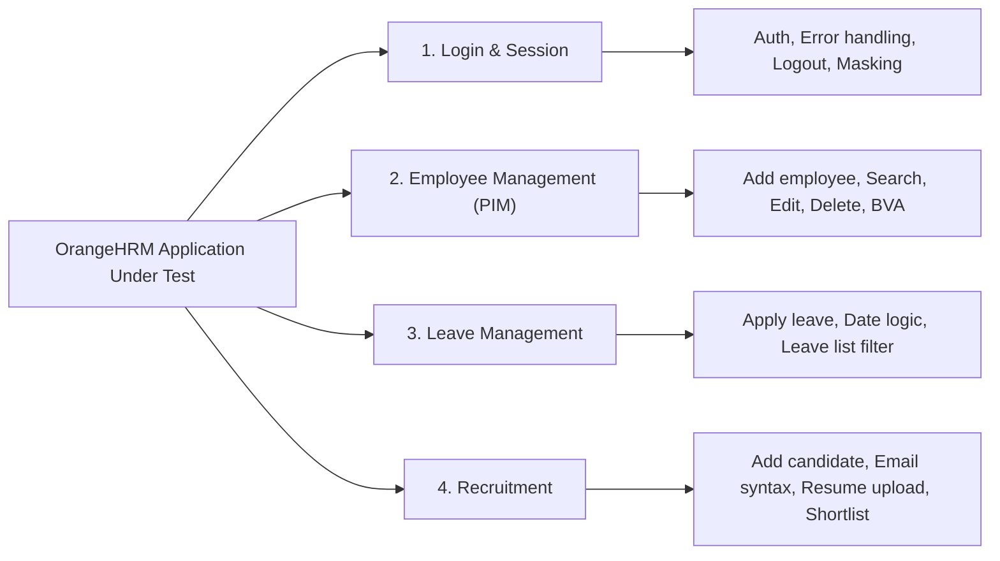

# OrangeHRM – Manual Testing Project

[](#)
[](#)
[](#)
[](#)
[-purple.svg)](https://github.com/PranaliO)

---

## 1. Project Overview
This repository contains a realistic, professional, interview-ready **Manual Software Testing** portfolio project based on the open-source web application **OrangeHRM (Version 5.x)**.

Created as a comprehensive demonstration of practical Quality Assurance fundamentals for a **2026 B.Tech Computer Science graduate**, this project reflects the complete **Software Testing Life Cycle (STLC)**—from requirement analysis and test design techniques to test execution planning, defect reporting, regression suites, and Requirement Traceability Matrix (RTM) engineering.

> [!IMPORTANT]  
> **Testing Approach: MANUAL TESTING ONLY**  
> This project is designed and documented **strictly using Manual Testing methodologies**. No automated test frameworks, scripts, or CI/CD pipelines (such as Selenium, Playwright, Cypress, TestNG, Cucumber, or Appium) are utilized. The goal is to demonstrate genuine, defensible Manual Testing excellence.

---

## 2. Objective
The primary objectives of this project are:
- Verify that core human resource workflows (employee management, leave applications, recruitment candidate progression) function reliably.
- Validate authentication security, session integrity, password masking, and error handling.
- Enforce data integrity through field validations, boundary value analysis, and equivalence partitioning.
- Log, isolate, and track software defects with industry-standard reproduction steps, severity, and priority.
- Provide complete bidirectional requirement traceability (Requirements ↔ Scenarios ↔ Test Cases ↔ Defects).
- Plan structured Smoke, Sanity, and Regression execution cycles to verify build quality without test duplication.

---

## 3. Application Under Test (AUT)
- **Application Name:** OrangeHRM Open Source (Official Public Sandbox)
- **Version:** OrangeHRM 5.x
- **Target URL:** `https://opensource-demo.orangehrmlive.com/web/index.php/auth/login`
- **Default Test Credentials:**
  - **Username:** `Admin`
  - **Password:** `admin123`
- **Application Nature:** Web-based Enterprise Human Resource Management (HRM) System

---

## 4. Modules Tested



1. **Login & Session Management:** Valid authentication, invalid credentials, empty field validations, password masking, "Forgot your password?" navigation, user profile dropdown logout, and session back-button termination.
2. **Employee Management (PIM):** Adding employees with mandatory/optional fields, custom and auto Employee IDs, boundary length validation, searching by name and ID, viewing profile details, editing personal info, and deleting records with confirmation modals.
3. **Leave Management:** Applying for leave, single-day vs. multi-day leave, chronological date boundary checks (To Date before From Date), comments length validation, leave list filtering by status/date, and request cancellation.
4. **Recruitment:** Adding candidates, mandatory name/email checks, email syntax validation, resume file upload rules (supported formats & size limits), candidate search by name/vacancy, and recruitment workflow stage progression (Shortlisting candidates).

---

## 5. Testing Scope

### In-Scope:
- Functional Testing & Business Rule Verification
- Positive (Happy Path) & Negative (Error Handling) Testing
- Boundary Value Analysis (BVA) & Equivalence Partitioning (EP)
- Decision Table Testing
- Error Guessing & Exploratory Testing
- Smoke Testing (10 critical stability test cases)
- Sanity Testing (Targeted defect-fix verification)
- Regression Testing (14 core regression test cases)
- Defect Logging & Retesting Lifecycle
- Cross-Browser UI Compatibility (Google Chrome & Microsoft Edge)

### Out-of-Scope:
- Automation scripts (Selenium, Cypress, Playwright, etc.)
- Performance / Load testing (JMeter)
- Direct backend database queries (MySQL access not exposed on public demo)
- Untested modules (Admin User Roles, Time/Timesheets, Performance, Payroll, Buzz, Maintenance)

---

## 6. Test Design Techniques Applied

| Technique | Where Applied in OrangeHRM | Purpose | Reference Document |
| :--- | :--- | :--- | :--- |
| **Boundary Value Analysis (BVA)** | Employee ID length (Min: 1 char, Max: 10 chars); Leave comments length (Max: 250 chars); Leave date range (Start = End date). | Verify system resilience at extreme boundaries where off-by-one errors happen. | [Test-Design-Techniques.md](file:///c:/Users/prana/Desktop/OrangeHRM%20%E2%80%93%20Manual%20Testing/03-Test-Design/Test-Design-Techniques.md) |
| **Equivalence Partitioning (EP)** | Candidate Email syntax (valid format vs missing `@` vs missing domain); Login credentials partitions; Resume file extensions. | Divide input domain into representative valid and invalid classes. | [Test-Design-Techniques.md](file:///c:/Users/prana/Desktop/OrangeHRM%20%E2%80%93%20Manual%20Testing/03-Test-Design/Test-Design-Techniques.md) |
| **Decision Table Testing** | Leave Application Submission Logic (Type selected + Dates valid + End Date >= Start Date -> Submit vs Validation errors). | Test combinations of multiple conditions driving distinct system outcomes. | [Test-Design-Techniques.md](file:///c:/Users/prana/Desktop/OrangeHRM%20%E2%80%93%20Manual%20Testing/03-Test-Design/Test-Design-Techniques.md) |
| **Error Guessing** | Trailing space in search inputs; Past date entries; Rapid double-clicks on submit; Inadvertent form cancellation. | Anticipate human error patterns and edge interactions. | [Test-Design-Techniques.md](file:///c:/Users/prana/Desktop/OrangeHRM%20%E2%80%93%20Manual%20Testing/03-Test-Design/Test-Design-Techniques.md) |

---

## 7. Test Suite Summary & Metrics

```
+---------------------------------------------------------------------------------+
|                              ORANGEHRM TEST SUITE                               |
+------------------------------+--------------------+-----------------------------+
| Module                       | Requirements Count | Total Test Cases Designed   |
+------------------------------+--------------------+-----------------------------+
| 01. Login & Session          | 5 Requirements     | 12 Test Cases               |
| 02. Employee Mgmt (PIM)      | 6 Requirements     | 18 Test Cases               |
| 03. Leave Management         | 5 Requirements     | 13 Test Cases               |
| 04. Recruitment              | 6 Requirements     | 13 Test Cases               |
+------------------------------+--------------------+-----------------------------+
| TOTAL                        | 22 Requirements    | 56 Detailed Test Cases      |
+------------------------------+--------------------+-----------------------------+
```

### Specialized Execution Subsets:
- **Smoke Testing Suite:** 10 Critical Test Cases (`ST-01` to `ST-10`)
- **Regression Testing Suite:** 14 Core Test Cases (`RT-01` to `RT-14`)
- **Defects Documented:** 6 Defects (0 Critical, 0 High, 2 Medium, 4 Low)

---

## 8. Defect Management & Tracking

Every defect is logged in [`05-Defect-Management/Bug-Reports.xlsx`](file:///c:/Users/prana/Desktop/OrangeHRM%20%E2%80%93%20Manual%20Testing/05-Defect-Management/Bug-Reports.xlsx) using standard QA attributes: Defect ID, Title, Module, Environment, Preconditions, Steps to Reproduce, Expected vs. Actual Result, Severity, Priority, Reproducibility, Status, Test Case ID, and Evidence Reference.

### Summary of Defects Logged:

| Defect ID | Module | Defect Summary | Severity | Priority | Status |
| :--- | :--- | :--- | :---: | :---: | :---: |
| `BUG_EMP_001` | PIM | Trailing whitespace in Employee Name search returns false "No Records Found" | Medium | Medium | Open |
| `BUG_LEAVE_001` | Leave | Date picker allows manual entry of past dates without immediate warning | Medium | Medium | Open |
| `BUG_REC_001` | Recruitment | Resume upload accepts double extensions (`sample.pdf.doc`) without MIME check | Low | Low | Open |
| `BUG_LOGIN_001` | Login | Leading whitespace in pasted password fails without helper guidance | Low | Low | Closed (Retested) |
| `BUG_EMP_002` | PIM | Employee ID leading zeros stripped in data grid causing search mismatch | Low | Low | Open |
| `BUG_REC_002` | Recruitment | Resetting candidate search leaves results counter label lagging | Low | Low | Open |

For full details and Severity vs. Priority analysis, see [Defect-Summary.md](file:///c:/Users/prana/Desktop/OrangeHRM%20%E2%80%93%20Manual%20Testing/05-Defect-Management/Defect-Summary.md).

---

## 9. Repository Structure

```
orangehrm-manual-testing-project/
│
├── README.md                                       <-- Portfolio Overview & Homepage
│
├── 01-Project-Documentation/
│   ├── Test-Plan.md                                <-- IEEE-829 Aligned Test Plan (3-5 pages)
│   ├── Scope-and-Objectives.md                     <-- Detailed Scope Boundaries & QA Goals
│   └── Test-Environment.md                         <-- Hardware, Browsers & URL Configuration
│
├── 02-Requirements/
│   └── Functional-Requirements.md                  <-- 22 Functional Requirements (FRS)
│
├── 03-Test-Design/
│   ├── Test-Scenarios.xlsx                         <-- 32 High-Level Test Scenarios (Excel)
│   ├── Test-Scenarios.md                           <-- Scenarios Viewable Directly on GitHub
│   ├── Test-Cases.xlsx                             <-- 56 Detailed Manual Test Cases (Excel)
│   ├── Test-Cases.md                               <-- All 56 Test Cases Formatted in Markdown
│   ├── Test-Data.xlsx                              <-- Test Data Sets (Excel)
│   ├── Test-Data.md                                <-- Test Data Sets (Markdown)
│   └── Test-Design-Techniques.md                   <-- BVA, EP, Decision Tables, Error Guessing
│
├── 04-Test-Execution/
│   ├── Test-Execution-Report.xlsx                  <-- Step-by-Step Execution Tracking (Excel)
│   └── Execution-Summary.md                        <-- Smoke, Sanity, Regression & Retesting
│
├── 05-Defect-Management/
│   ├── Bug-Reports.xlsx                            <-- 6 Detailed Defect Reports (Excel)
│   ├── Bug-Reports.md                              <-- Defect Reports Formatted in Markdown
│   └── Defect-Summary.md                           <-- Defect Lifecycle & Severity vs Priority
│
├── 06-RTM/
│   ├── Requirement-Traceability-Matrix.xlsx        <-- Bidirectional RTM (Excel)
│   └── Requirement-Traceability-Matrix.md          <-- RTM Table Formatted in Markdown
│
├── 07-Test-Summary/
│   └── Test-Summary-Report.md                      <-- Final Evaluation, Metrics & Risk Table
│
└── 08-Interview-Preparation/
    └── Manual-Testing-Interview-Notes.md           <-- 55 Q&As, 2-Min Pitch, SQL & Agile Notes
```

---

## 10. Resume-Ready Project Description

You can directly add these bullet points to your resume under **Projects**:

### Bullet Points for Resume:
- **OrangeHRM – Manual Testing Portfolio Project**
  - Spearheaded end-to-end manual functional, UI, and positive/negative testing across 4 core OrangeHRM modules (Login, PIM, Leave, Recruitment) based on 22 functional specifications.
  - Authored **56 high-quality manual test cases** and 32 scenarios using formal black-box techniques (**Boundary Value Analysis**, **Equivalence Partitioning**, and **Decision Tables**), maintaining **100% bidirectional traceability** via an RTM.
  - Engineered dedicated **Smoke (10 cases)** and **Regression (14 cases)** suites, executed exploratory testing charters, and documented **6 defects** with precise reproduction steps, severity/priority ratings, and retesting lifecycles.

---

## 11. Manual Execution Checklist

When conducting live test execution on OrangeHRM, follow this standardized workflow:

1. **Environment Check:** Open Google Chrome (or Edge), navigate to `https://opensource-demo.orangehrmlive.com/web/index.php/auth/login`, and confirm site availability.
2. **Execute Smoke Suite:** Run `TC_LOGIN_001` to `TC_LOGIN_010` (the 10 smoke cases in `Execution-Summary.md`) to verify build health.
3. **Module-by-Module Execution:**
   - Open `04-Test-Execution/Test-Execution-Report.xlsx` or `03-Test-Design/Test-Cases.xlsx`.
   - Read Preconditions and prepare Test Data from `Test-Data.xlsx`.
   - Execute numbered steps carefully on the browser.
4. **Record Observations:**
   - Compare observed system output with **Expected Result**.
   - In `Actual Result`, record exact system behavior.
   - If expected equals actual: Mark **Status** as `Pass`.
   - If behavior deviates: Mark **Status** as `Fail`.
5. **Defect Logging Workflow (On Failure):**
   - Retest steps once to verify reproducibility.
   - Press `Win + Shift + S` or use Snipping Tool to capture screenshot evidence.
   - Open `05-Defect-Management/Bug-Reports.xlsx` and log a new Defect ID (`BUG_...`).
   - Assign appropriate **Severity** (technical impact) and **Priority** (business urgency).
   - Enter Defect ID into the corresponding row in `Test-Execution-Report.xlsx` and `Requirement-Traceability-Matrix.xlsx`.
6. **Retesting & Regression:** Rerun verified test cases after fixes and execute the 14-case regression suite to prevent regression defects.

---

## 12. Quality Audits

### Consistency Audit:
- **Requirements ↔ Scenarios:** All 22 requirements map to corresponding scenarios in `03-Test-Design/Test-Scenarios.xlsx`.
- **Scenarios ↔ Test Cases:** All 32 scenarios expand into 56 executable test cases in `03-Test-Design/Test-Cases.xlsx`.
- **Test Cases ↔ RTM:** 100% of test cases and requirements are mapped bidirectionally in `06-RTM/Requirement-Traceability-Matrix.xlsx`.
- **Defects ↔ Test Cases:** Every defect references its origin test case (`TC_EMP_009`, `TC_LEAVE_002`, `TC_REC_008`, `TC_LOGIN_002`, `TC_EMP_007`, `TC_REC_011`).
- **Regression Suite:** All 14 regression test cases originate from the master 56-case suite without duplicate IDs.

### Authenticity Audit:
- No exaggerated enterprise claims (e.g., no "5 years experience", no "enterprise automation architecture").
- No automation tools claimed (strictly Manual Testing).
- All documented features reflect actual OrangeHRM Open Source 5.x functionality.
- Initial execution status set to "Not Executed" with realistic defect examples.
- Clear distinction between tester knowledge and hands-on portfolio execution.

---

## 13. Tools Used
- **Test Application:** OrangeHRM Open Source (v5.x Demo)
- **Browsers:** Google Chrome v128+, Microsoft Edge v128+
- **Documentation:** Microsoft Excel (.xlsx), Markdown (.md)
- **Version Control & Hosting:** Git & GitHub ([https://github.com/PranaliO](https://github.com/PranaliO))
- **Diagrams & Visuals:** Mermaid.js

---

## 14. Disclaimer
*This project is a personal Manual Testing portfolio created by Pranali for educational and professional demonstration purposes. OrangeHRM is the intellectual property of OrangeHRM Inc. The candidate is not an employee of OrangeHRM, and this portfolio represents independent testing conducted on the public demo instance.*
