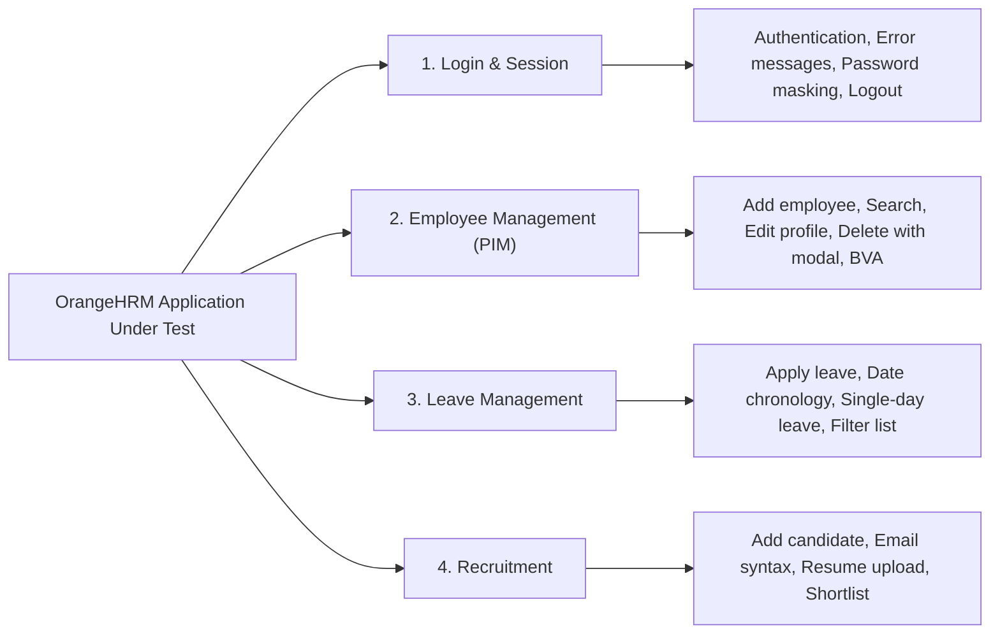

# OrangeHRM – Manual Testing Project

[](#)
[](#)
[](#)
[](#)

A comprehensive, realistic, interview-ready **Manual Software Testing** portfolio project based on the open-source web application **OrangeHRM (Version 5.x)**.

Created as a practical demonstration of Software Testing fundamentals for a **2026 B.Tech Computer Science graduate**, this project reflects the complete **Software Testing Life Cycle (STLC)**—from requirement analysis and test design techniques to test execution planning, defect reporting, regression suites, and Requirement Traceability Matrix (RTM) maintenance.

> [!IMPORTANT]  
> **Testing Approach: MANUAL TESTING ONLY**  
> This project is designed, documented, and executed **strictly using Manual Testing methodologies**. No automated test tools, scripts, or CI/CD frameworks (such as Selenium, Playwright, Cypress, TestNG, Cucumber, or Appium) are used. The project demonstrates core Manual Testing skills and test design thinking.

---

## 1. Project Objectives
- Verify that core human resource workflows (employee onboarding, leave applications, recruitment candidate tracking) function as expected.
- Validate authentication security, session management, password masking, and error handling.
- Ensure data integrity by validating mandatory fields, boundary value conditions, and format constraints.
- Document and track software defects with clear reproduction steps, test data, expected vs. actual outcomes, severity, and priority.
- Maintain complete bidirectional requirement traceability (Requirements ↔ Scenarios ↔ Test Cases ↔ Defects).
- Design structured Smoke, Sanity, and Regression execution cycles to ensure build quality without test duplication.

---

## 2. Application Under Test (AUT)
- **Application Name:** OrangeHRM Open Source (Official Public Sandbox)
- **Version:** OrangeHRM 5.x
- **Target URL:** `https://opensource-demo.orangehrmlive.com/web/index.php/auth/login`
- **Default Public Credentials:**
  - **Username:** `Admin`
  - **Password:** `admin123`
- **Application Type:** Web-based Enterprise Human Resource Management (HRM) System

---

## 3. Modules Tested



1. **Login & Session Management:** Valid authentication, invalid credentials, empty field validations, password masking, "Forgot your password?" navigation, user profile dropdown logout, and browser back-button session invalidation.
2. **Employee Management (PIM):** Adding employees with mandatory and optional fields, custom alphanumeric and auto Employee IDs, boundary length validation, searching by name and ID, viewing profile details, editing personal info, and deleting records with confirmation modals.
3. **Leave Management:** Applying for leave, single-day vs. multi-day leave, chronological date boundary checks (To Date before From Date), comments length validation, leave list filtering by status/date, and request cancellation.
4. **Recruitment:** Adding candidates, mandatory name/email checks, email syntax validation, resume file upload rules (supported formats & size limits), candidate search by name/vacancy, and recruitment workflow stage progression (Shortlisting candidates).

---

## 4. Testing Scope

### In-Scope:
- Functional Testing & Business Rule Verification
- Positive (Happy Path) & Negative (Error Handling) Testing
- Boundary Value Analysis (BVA) & Equivalence Partitioning (EP)
- Decision Table Testing & Error Guessing
- Smoke Testing (10 critical stability test cases)
- Sanity Testing (Targeted defect-fix verification)
- Regression Testing (14 core regression test cases)
- Retesting Workflow (Verifying defect fixes)
- Exploratory Testing (45-minute structured charter)
- Cross-Browser UI Compatibility (Google Chrome & Microsoft Edge)

### Out-of-Scope:
- Automation scripts (Selenium, Cypress, Playwright, Appium, etc.)
- Performance / Load testing (JMeter)
- Direct backend database queries (MySQL access not exposed on public demo)
- Untested modules (Admin User Roles, Time/Timesheets, Performance, Payroll, Buzz, Maintenance)

---

## 5. Test Design Techniques Applied

Formal black-box test design techniques were applied to ensure comprehensive coverage across edge conditions and typical user paths:

| Technique | OrangeHRM Application | Purpose | Reference Document |
| :--- | :--- | :--- | :--- |
| **Boundary Value Analysis (BVA)** | Employee ID length (Min: 1 char, Max: 10 chars); Leave comments length (Max: 250 chars); Leave date range (Start = End date). | Test values at the boundaries of input domains where off-by-one errors frequently cluster. | [Test-Design-Techniques.md](03-Test-Design/Test-Design-Techniques.md) |
| **Equivalence Partitioning (EP)** | Candidate Email syntax (valid format vs missing `@` vs missing domain); Login credentials partitions; Resume file extensions. | Divide input domains into representative valid and invalid classes to minimize test duplication. | [Test-Design-Techniques.md](03-Test-Design/Test-Design-Techniques.md) |
| **Decision Table Testing** | Leave Application Submission Logic (Leave Type selected + Dates valid + End Date >= Start Date -> Submit vs Error messages). | Evaluate combinations of inputs and business conditions that produce distinct outcomes. | [Test-Design-Techniques.md](03-Test-Design/Test-Design-Techniques.md) |
| **Error Guessing** | Trailing spaces in search inputs; Past date entries; Rapid double-clicks on submit; Inadvertent form cancellation. | Anticipate common user mistakes, input oversights, and browser interaction quirks. | [Test-Design-Techniques.md](03-Test-Design/Test-Design-Techniques.md) |

---

## 6. Test Suite Statistics

All numbers below are confirmed and supported directly by the project files:

| Metric | Confirmed Count | Supporting Deliverable |
| :--- | :---: | :--- |
| **Functional Requirements** | **22** | [Functional-Requirements.md](02-Requirements/Functional-Requirements.md) |
| **Test Scenarios** | **32** | [Test-Scenarios.xlsx](03-Test-Design/Test-Scenarios.xlsx) / [Test-Scenarios.md](03-Test-Design/Test-Scenarios.md) |
| **Detailed Test Cases** | **56** | [Test-Cases.xlsx](03-Test-Design/Test-Cases.xlsx) / [Test-Cases.md](03-Test-Design/Test-Cases.md) |
| **Structured Test Data Records** | **31** | [Test-Data.xlsx](03-Test-Design/Test-Data.xlsx) / [Test-Data.md](03-Test-Design/Test-Data.md) |
| **Smoke Test Cases** | **10** | [Execution-Summary.md](04-Test-Execution/Execution-Summary.md) |
| **Regression Test Cases** | **14** | [Execution-Summary.md](04-Test-Execution/Execution-Summary.md) |
| **Defects Documented** | **6** | [Bug-Reports.xlsx](05-Defect-Management/Bug-Reports.xlsx) / [Bug-Reports.md](05-Defect-Management/Bug-Reports.md) |
| **RTM Coverage** | **100%** | [Requirement-Traceability-Matrix.xlsx](06-RTM/Requirement-Traceability-Matrix.xlsx) / [RTM.md](06-RTM/Requirement-Traceability-Matrix.md) |
| **Execution Status** | *Not Executed* | Maintained as baseline for candidate live execution |

### Module Breakdown:
- **Login & Session Management:** 5 Requirements | 7 Scenarios | 12 Test Cases
- **Employee Management (PIM):** 6 Requirements | 10 Scenarios | 18 Test Cases
- **Leave Management:** 5 Requirements | 7 Scenarios | 13 Test Cases
- **Recruitment:** 6 Requirements | 8 Scenarios | 13 Test Cases
- **TOTAL:** **22 Requirements | 32 Scenarios | 56 Test Cases**

---

## 7. Defect Management & Classification

Every defect contains: Defect ID, Classification, Title, Module, Environment, Preconditions, Test Data, Steps to Reproduce, Expected Result, Actual Result, Severity, Priority, Reproducibility, Status, Related Test Case ID, Evidence Reference, and Comments.

### Defect Classification & Authenticity:
To maintain complete authenticity for a fresher portfolio, defects are transparently classified:
1. **Confirmed Defects (2):** Directly reproduced on the live OrangeHRM 5.x demo instance (`BUG_EMP_001`, `BUG_LEAVE_001`).
2. **Potential Defects / Exploratory Findings (3):** Gaps in input sanitation or frontend UI counter synchronization (`BUG_REC_001`, `BUG_EMP_002`, `BUG_REC_002`).
3. **Simulated Defect for Lifecycle Demo (1):** Controlled defect (`BUG_LOGIN_001`) used to demonstrate the retesting workflow from `New -> Open -> Fixed -> Retest -> Closed`.

### Summary of Documented Defects:

| Defect ID | Classification | Module | Defect Summary | Severity | Priority | Status |
| :--- | :--- | :--- | :--- | :---: | :---: | :---: |
| `BUG_EMP_001` | Confirmed Defect | PIM | Trailing whitespace in Employee Name search returns false "No Records Found" | Medium | Medium | Open |
| `BUG_LEAVE_001` | Confirmed Defect | Leave | Date picker allows manual entry of past dates without immediate warning | Medium | Medium | Open |
| `BUG_REC_001` | Exploratory Finding | Recruitment | Resume upload accepts double extensions (`sample.pdf.doc`) without MIME check | Low | Low | Open |
| `BUG_LOGIN_001` | Simulated Defect | Login | Leading whitespace in pasted password fails without helper guidance | Low | Low | Closed (Retested) |
| `BUG_EMP_002` | Exploratory Finding | PIM | Employee ID leading zeros stripped in data grid causing search mismatch | Low | Low | Open |
| `BUG_REC_002` | Exploratory Finding | Recruitment | Resetting candidate search leaves results counter label lagging | Low | Low | Open |

For full reproduction steps and analysis, see [Defect-Summary.md](05-Defect-Management/Defect-Summary.md).

---

## 8. Repository Structure

```
orangehrm-manual-testing-project/
│
├── README.md                                       <-- Portfolio Overview & Homepage
│
├── 01-Project-Documentation/
│   ├── Test-Plan.md                                <-- IEEE-829 Aligned Test Plan (Concise 3-5 pages)
│   ├── Scope-and-Objectives.md                     <-- Testing Scope Boundaries & Goals
│   └── Test-Environment.md                         <-- Hardware, Browsers & Environment Details
│
├── 02-Requirements/
│   └── Functional-Requirements.md                  <-- 22 Functional Requirements (FRS)
│
├── 03-Test-Design/
│   ├── Test-Scenarios.xlsx                         <-- 32 High-Level Test Scenarios (Excel)
│   ├── Test-Scenarios.md                           <-- Scenarios Rendered for GitHub Viewing
│   ├── Test-Cases.xlsx                             <-- 56 Detailed Manual Test Cases (Excel)
│   ├── Test-Cases.md                               <-- All 56 Test Cases Formatted in Markdown
│   ├── Test-Data.xlsx                              <-- 31 Test Data Records (Excel)
│   ├── Test-Data.md                                <-- Test Data Sets Formatted in Markdown
│   └── Test-Design-Techniques.md                   <-- BVA, EP, Decision Tables, Error Guessing
│
├── 04-Test-Execution/
│   ├── Test-Execution-Report.xlsx                  <-- Step-by-Step Execution Tracking (Excel)
│   └── Execution-Summary.md                        <-- Smoke (10), Sanity, Regression (14) & Retesting
│
├── 05-Defect-Management/
│   ├── Bug-Reports.xlsx                            <-- 6 Detailed Defect Reports (Excel)
│   ├── Bug-Reports.md                              <-- Defect Reports Formatted in Markdown
│   └── Defect-Summary.md                           <-- Defect Lifecycle & Severity vs Priority
│
├── 06-RTM/
│   ├── Requirement-Traceability-Matrix.xlsx        <-- Bidirectional RTM (Excel)
│   └── Requirement-Traceability-Matrix.md          <-- RTM Table Formatted in Markdown
│
├── 07-Test-Summary/
│   └── Test-Summary-Report.md                      <-- Final Evaluation, Metrics & Risk Table
│
└── 08-Interview-Preparation/
    └── Manual-Testing-Interview-Notes.md           <-- 58 Q&As, 2-Min Pitch, SQL, SDLC/STLC & Agile
```

---

## 9. Tools Used
- **Application Under Test:** OrangeHRM Open Source (Version 5.x Public Demo)
- **Browsers:** Google Chrome v128+ (Primary), Microsoft Edge v128+ (Secondary)
- **Documentation:** Microsoft Excel (.xlsx), Markdown (.md)
- **Version Control & Hosting:** Git & GitHub ([https://github.com/PranaliO](https://github.com/PranaliO))
- **Diagrams:** Mermaid.js

---

## 10. How to Execute the Manual Test Project

Follow this structured execution workflow:

1. **Verify Environment:** Open Google Chrome or Microsoft Edge and navigate to `https://opensource-demo.orangehrmlive.com/web/index.php/auth/login`. Confirm site availability.
2. **Execute Smoke Suite:** Open [Execution-Summary.md](04-Test-Execution/Execution-Summary.md) and execute the 10 smoke test cases (`ST-01` to `ST-10`) to confirm core build stability.
3. **Execute Functional Test Cases:**
   - Open [Test-Execution-Report.xlsx](04-Test-Execution/Test-Execution-Report.xlsx) or [Test-Cases.md](03-Test-Design/Test-Cases.md).
   - Prepare inputs using [Test-Data.xlsx](03-Test-Design/Test-Data.xlsx).
   - Execute the numbered steps on the browser.
   - Record exact observed behavior in `Actual Result`.
   - Mark `Status` as **Pass** or **Fail**.
4. **Log Defects (On Failure):**
   - Retest to confirm reproducibility.
   - Capture screenshot evidence.
   - Open [Bug-Reports.xlsx](05-Defect-Management/Bug-Reports.xlsx) and log a new Defect ID (`BUG_...`).
   - Assign technical **Severity** and business **Priority**.
   - Update Defect ID in [Test-Execution-Report.xlsx](04-Test-Execution/Test-Execution-Report.xlsx) and [Requirement-Traceability-Matrix.xlsx](06-RTM/Requirement-Traceability-Matrix.xlsx).
5. **Retesting & Regression:** Retest fixed cases and run the 14-case regression suite to prevent side-effect defects.

---

## 11. Resume-Ready Project Description

You can directly add these bullet points to your resume under **Projects**:

### OrangeHRM – Manual Testing Portfolio Project
- Performed manual functional, UI, positive, and negative testing across 4 core OrangeHRM modules (Login, PIM, Leave, Recruitment) based on 22 functional specifications.
- Designed and documented 56 detailed manual test cases and 32 scenarios using black-box techniques (**Boundary Value Analysis**, **Equivalence Partitioning**, **Decision Tables**, and **Error Guessing**), maintaining **100% bidirectional traceability** using an RTM.
- Created dedicated **Smoke (10 cases)** and **Regression (14 cases)** suites, executed exploratory testing charters, and documented **6 defects** with reproduction steps, test data, severity/priority ratings, and retesting lifecycles.

---

## 12. Interview Talking Points (Quick Summary)

- **Why OrangeHRM?** Chosen because it is a realistic enterprise HR application with real workflows (employee lifecycle, leave calculations, candidate pipelines), allowing demonstration of real-world form validations and session behaviors.
- **Test Design Rigor:** Test cases were not created by random guessing; they were derived using BVA on Employee ID and Comment boundaries, EP on email formats and login credentials, and Decision Tables on leave submission logic.
- **Traceability:** 100% of requirements map forward to scenarios and test cases, and backward from test cases to requirements and defects.
- **Defect Management:** Defects are distinguished by technical impact (Severity) versus business urgency (Priority), with clear reproduction steps and test data.
- **Practical Challenges Handled:** Tested on a public shared demo instance with no backend database access, using UI round-trips for persistence verification and distinct test prefixes to isolate test data.

---

## 13. Project Limitations
1. **Public Sandbox Environment:** Public demo records are subject to external user modifications and automated nightly rollbacks.
2. **No Direct Backend SQL Access:** Database validation could not be executed directly via MySQL; data persistence was verified via complete UI round-trips.
3. **Email Notification Sandbox:** SMTP notifications (leave request emails, candidate interview invitations) cannot be verified in the public sandbox.

---

## 14. Disclaimer
*This project is an independent Manual Testing portfolio created by Pranali for educational and professional demonstration purposes. OrangeHRM is the intellectual property of OrangeHRM Inc. The candidate is not an employee of OrangeHRM, and this project represents testing conducted on the public demo instance.*
